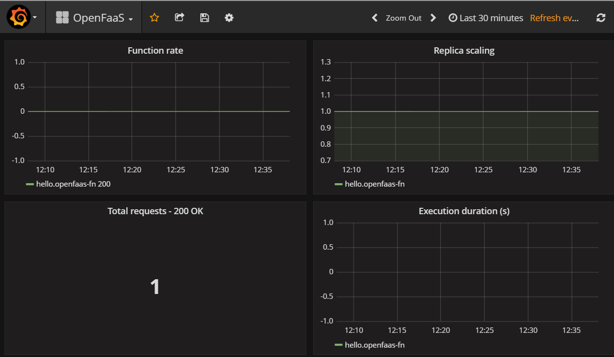

For tracking metrics on your deployed functions, OpenFaas uses [Prometheus](https://prometheus.io/docs/introduction/overview/), an open-source tool for monitoring and collecting metrics as time-series data. To visualise the metrics into an useful graph, [Grafana](https://grafana.com/oss/grafana/) is used to turn the metrics into an useful dashboard.

Follow these steps to deploy and access Grafana:
1. Make Grafana run in the kubernetes cluster: `kubectl -n openfaas run --image=stefanprodan/faas-grafana:4.6.3 --port=3000 grafana`{{execute}} 
2. Then expose Grafana with a NodePort: `kubectl -n openfaas expose pod grafana --type=NodePort --name=grafana`{{execute}}
3. Then get the port which Grafana was exposed to: `GRAFANA_PORT=$(kubectl -n openfaas get svc grafana -o jsonpath="{.spec.ports[0].nodePort}") && echo $GRAFANA_PORT`{{execute}}
Copy the port.
4. Open the Grafana tab and paste the port on the box.
5. When the dashboard is visible, authenticate yourself with the credentials admin/admin. Then navigate to the OpenFaas dashboard by pressing `home` and then selecting `openFaas`.

You should be able to see the pre-made OpenFaaS dashboard which looks like this:

The dashboard displays useful information: the Function rate, the Replica scaling, the Total Requests - 200 and the Execution duration (s).

