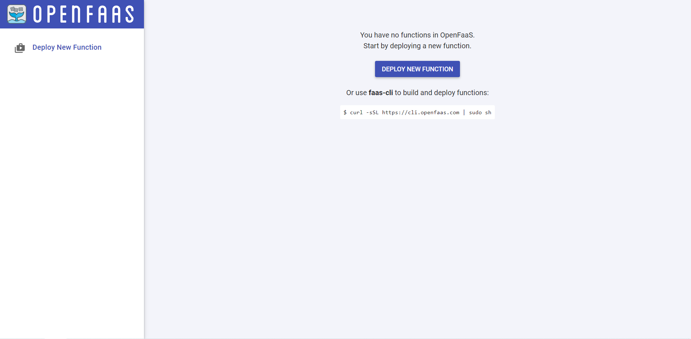

## OpenFaas UI
To access the UI, you need to first obtain the password that is auto-generated by OpenFaas and kept as a *secret* (object that contains sensistive data) in the kubernetes cluster. 
This is done with the command:  
`PASSWORD=$(kubectl get secret -n openfaas basic-auth -o jsonpath="{.data.basic-auth-password}" | base64 --decode; echo)`{{execute}}. 
Display it in the terminal to see the password: `echo $PASSWORD`{{execute}}. 
Copy the password before moving on.

To access the UI, open the OpenFaas tab and refresh it. A pop-up will then appear which requires your credentials. Authorize using the username *admin* and paste the password as the copied value from the echo. 

If correct, The OpenFaas UI should appear similar like this:

## OpenFaas CLI
Another alternative to work with OpenFaas is the faas-cli.
Install the Faas-cli: `curl -SLsf https://cli.openfaas.com | sudo sh`{{execute}}

The commands we will use at this tutorial are *new*, *build*, *push* and *deploy*.
To be able to deploy functions using the cli you have to authenticate yourself: `faas-cli login --password $PASSWORD`{{execute}}

You can see more commands through `faas-cli --help`{{execute}}, for more details about each command add the desired command between `faas-cli` and `--help`.
