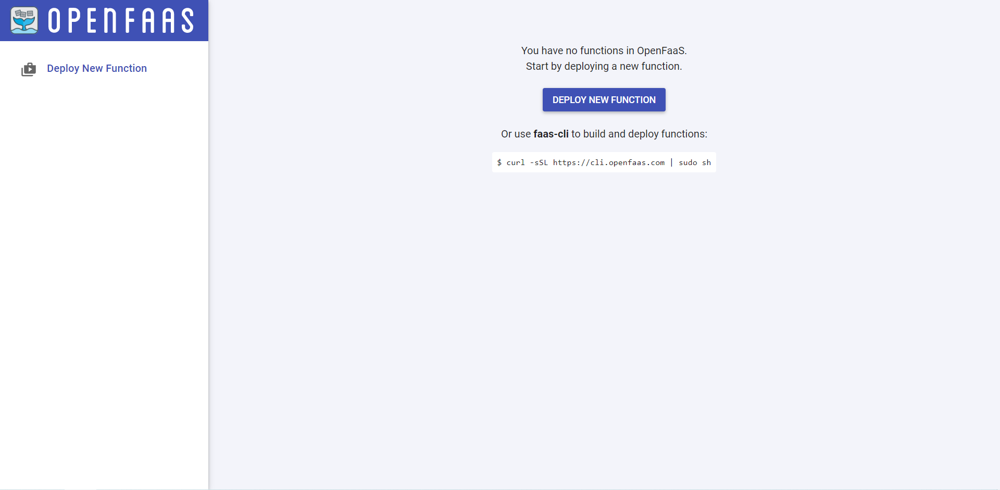

To access the UI, you need to first obtain the password that is auto-generated by OpenFaas and kept as a *secret* (object that contains sensistive data) in the kubernetes cluster. This is done with the cli: `PASSWORD=$(kubectl get secret -n openfaas basic-auth -o jsonpath="{.data.basic-auth-password}" | base64 --decode; echo)`{{execute}}. Echo it in the terminal to see the password: `echo $PASSWORD`{{execute}}. Copy the password before moving on.

To access the UI, open a new tab in the terminal (the + sign beside the terminal) and select **View HTTP port 80 on Host 1**. This leads to a new page for connecting to ports. The default port for OpenFaas UI is **31112**, this is the Kubernetes NodePort of the external-gateway OpenFaaS service. Input the port number at the textbox and click *display port*.

A pop-up will then appear which requires your credentials. Authorize using the username *admin* and the password as the copied value from the echo. 

If correct, The OpenFaas UI should appear similar like this:

With OpenFaas installed and setup, you are now ready to write your first serverless functions and deploy them to kubernetes!